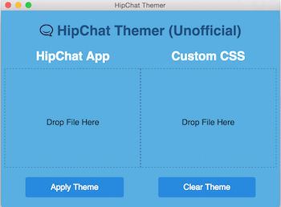
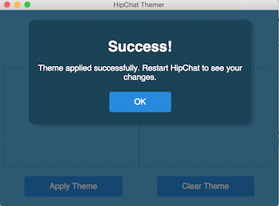
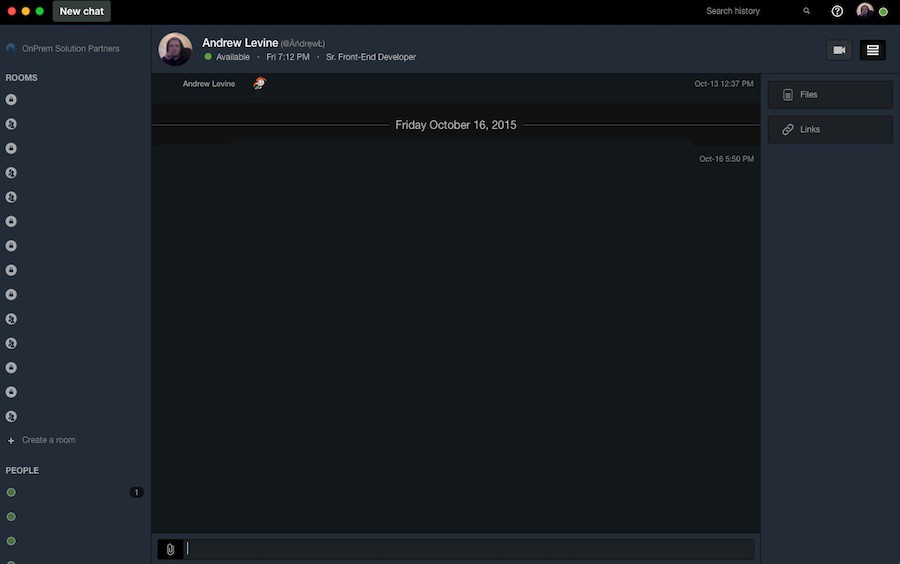

# HipChat Themer

This application is an automated version of the theming method [discussed in this blog post](https://medium.com/@andrew_levine/theming-the-new-hipchat-4-beta-for-osx-64e4ba4a6749).

**Note: Application is currently only distributed as source. You must build it to use it.**

 


## Development

### Getting Setup

**Prerequisites: Ensure you have a version of `node.js` > 4.0.0**

1. Clone the repository
2. Run `npm install`

### Building/Running

#### Building
```
npm run build
```

#### Running
```
npm start
```

#### Build and start
```
npm run freshstart
```

### Usage

1. Open the application
2. Drag the `HipChat-Beta.app` file from finder into the `HipChat App` section
3. Drag your custom CSS file into the `Custom CSS` section
4. Click `Apply Theme`

### Issues?

Please [report any issues you have here](https://github.com/DrewML/hipchat-themer/issues/new). I'm happy to help when I have the time
